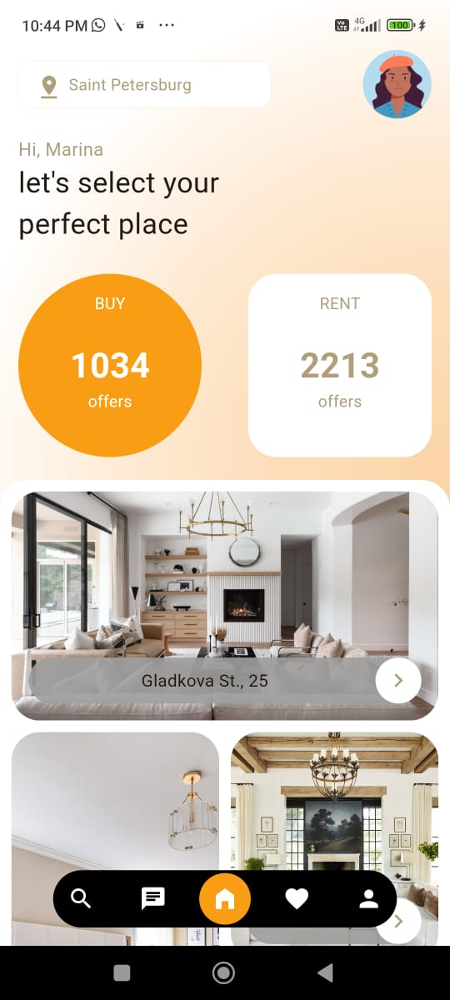
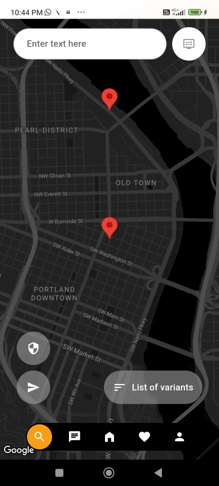

# Real Estate

A Flutter project for Real estate business with animations. Ref [Dribble: Real Estate](https://dribbble.com/shots/23780608-Real-Estate-App)

## How to run code

Replace API key in Android manifest(android/app/src/main/AndroidManifest.xml), line number 35. 

Here is the [APK](https://drive.google.com/file/d/17CajoKqfOT9OgvyNYXYQ99Lyx1wmvFlc/view?usp=sharing)

## Video
<video width="320" height="240" controls>
  <source src="./demo/demo.mp4" type="video/mp4">
  Your browser does not support the video tag.
</video>

## Screen shots

|   |   |
|---|---|
